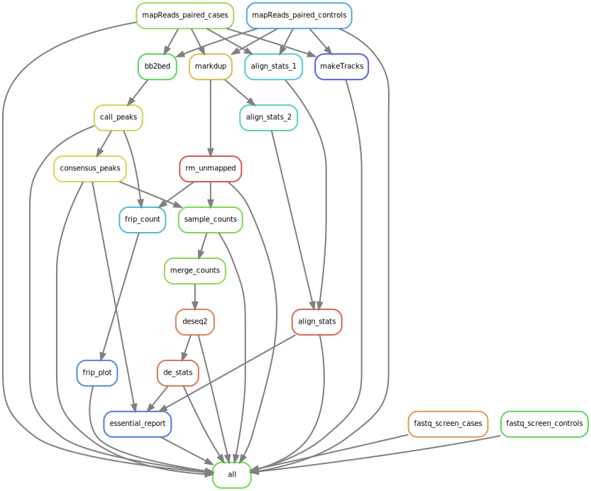

# ChIP-seq-pipeline

This is a pipeline to run basic Chromatin immunoprecipitation sequencing analysis for single-end or paired-end data.

This is a package of bash scripts that enable reading, processing and analysis of ChIP-seq Omics' datasets. This package implements the Snakemake management workflow system and is currently implemented to work with the cluster management and job scheduling system SLURM. This snakemake workflow utilizes conda installations to download and use packages for further analysis, so please ensure that you have installed miniconda prior to use.

# Questions/issues

Please add an issue to the ChIP-seq repository. We would appreciate if your issue included sample code/files (as appropriate) so that we can reproduce your bug/issue.

# Contributing

We welcome contributors! For your pull requests, please include the following:

Sample code/file that reproducibly causes the bug/issue
Documented code providing fix
Unit tests evaluating added/modified methods.

# Features exclusive to Maxson-Braun Lab fork

* Quality control
  * Fraction of Reads in Peaks for all samples: `data/qc/frip.html`
  * PCA for each histone mark / transcription factor with DESeq2: `results/de/{factor}.png`
* Useful outputs
  * **Consensus peaks** = by default, for each factor, select genomic intervals where a peak is in _n_ replicates in at least one condition. `samples/macs/{factor}_peaks.txt`
  * **Consensus peaks stats** = for each factor and each condition, count how many unique and overlapping intervals appear across replicates. `samples/macs/consensus_stats.txt`
  * **Raw counts table by factor** = counts of pileups at consensus intervals per factor using bedtools multicov, includes only samples with relevant factors. E.g. MYC samples do not appear in RUNX count table. `data/{factor}_counts.txt`
* Differential peak analysis via DESeq2
  * Default parameters were used for differential analysis.
  * All contrasts are assessed by default: `results/de/diffexp/{cond1}-{cond2}/`

# Assumptions of the data

The data should be in the shape of a square or rectangle where all antibodies are treated to all conditions with equal replicates. Something like this:

| Cond | Replicate | Transcription Factor / Histone Mark |
| ---- | --------- | ----------------------------------- |
| A    | 1         | X                                   |
| A    | 2         | X                                   |
| B    | 1         | X                                   |
| B    | 2         | X                                   |
| C    | 1         | X                                   |
| C    | 2         | X                                   |
| D    | 1         | Y                                   |
| D    | 2         | Y                                   |
| E    | 1         | Y                                   |
| E    | 2         | Y                                   |
| F    | 1         | Y                                   |
| F    | 2         | Y                                   |

This is not so important for read alignment and peak calling, but will be important for merging counts tables across factors followed by differential analysis. 

# Usage:

Locate raw files.

```
$ cd /path/to/raw/data
$ ls -alh
```

Check md5sum.

```
$ md5sum –c md5sum.txt > md5sum_out.txt
```

Move your files into the archive to be stored.

```
$ mv /path/to/raw/data /path/to/archive
```

Check md5sum again in the archive to ensure your sequencing files are not corrupted.

```
$ md5sum –c md5sum.txt > md5sum_out.txt
```

Clone the ChIP-seq Pipeline into your working directory.

```
$ git clone https://github.com/ohsu-cedar-comp-hub/ChIP-seq-pipeline.git
```

Create a `samples/cases`, a `samples/controls` directory, and a `logs` directory in your `wdir()`.

```
$ mkdir logs
$ mkdir samples
$ mkdir samples/cases
$ mkdir samples/controls
```

Symbollically link the fastq files of your samples to the `wdir/samples/cases` directory using a bash script loop in your terminal.

* For PE data:

```
$ cd samples/cases
$ ls -1 /path/to/data/LIB*R1*gz | while read gz; do
    R1=$( basename $gz | cut -d _ -f 2 | awk '{print $1"_R1.fastq.gz"}' )
    R2=$( basename $gz | cut -d _ -f 2 | awk '{print $1"_R2.fastq.gz"}' )
    echo $R1 : $R2
    ln -s $gz ./$R1
    ln -s ${gz%R1_001.fastq.gz}R2_001.fastq.gz ./$R2
done
```

* For SE data:

```
$ cd samples/cases
$ ls -1 /path/to/data/LIB*gz | while read gz; do 
  R=$( basename $gz | cut -d '_' -f 2 | awk '{print $1".fastq.gz"}' )
  echo $R
  ln -s $gz ./$R
done
```

Then move your controls that you have defined in the `metadata.txt` file to `samples/controls`.

```
$ mv samples/cases/{FileName1,FileNameN}.fastq.gz samples/controls
```

Lastly your filenames should be formatted like so:

```
{condition}{replicate}_{factor}_[R1|R2].fastq.gz
```

In the case of `MOLM24D1_MYC_R1.fastq.gz`,  MOLM24D is condition, 1 is replicate, and MYC factor. 

Upload your metadata file to the `data` directory, with the correct columns:

* This file should be formatted as such:

```
SampleID  Control   Peak_call
H3K4Me3-1  samples/bed/IgG.bed  narrow
```

* Each row should be a `CASE` (i.e. not an Input/IgG), with the `Control` for that sample listed (written as `samples/bed/{ControlID}.bed`) and the type of peak calling you would like (either `broad` or `narrow`)
* All elements in this file should be tab-separated
* An example file is located in this repository here: `data/metadata.txt`

Edit the `omic_config.yaml` in your `wdir()`:

* Write the full path towards your `metadata.txt` file under the `samples` category
* Specify the genome `assembly` you would like to use
  * Current options for this are: hg19 and hg38
* Specify your `seq_type`
  * Either `SE` or `PE`

Do a dry-run of snakemake to ensure proper execution before submitting it to the cluster (in your wdir).

```
$ snakemake -np --verbose
```

Once your files are symbolically linked, you can submit the job to exacloud via your terminal window.

```
$ sbatch submit_snakemake.sh
```

To see how the job is running, look at your queue.

```
$ squeue -u your_username
```

Directed Acyclic Graph (DAG) of an example workflow including two samples
======================

